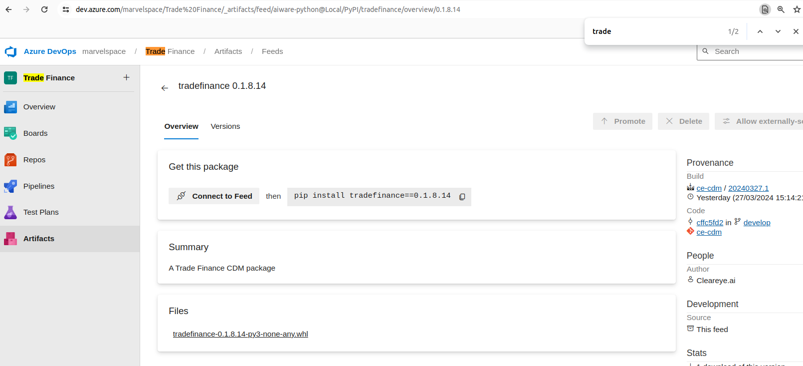
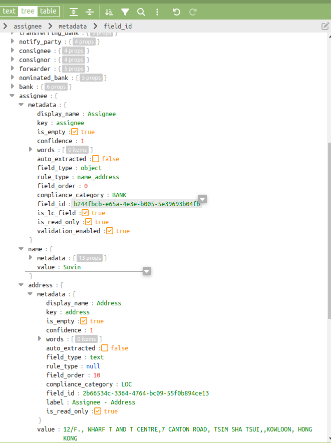
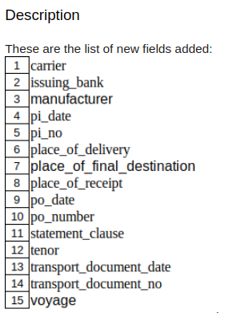

# 1 Introduction and Summary

The Common Data Model (CDM) serves as a standardized and structured framework for organizing and representing data across all applications within ClearTrade.

In this guide, we'll explore how the CDM serves as the backbone for organizing and managing data across all applications within the ClearTrade platform.

The purpose of this document is to provide a step-by-step guide to entering a Project, Package, and tag management.

## 1.1 PURPOSE

The purpose of the CDM is to establish a standardized and unified approach to data representation within the project. It aims to ensure consistency, integrity, and data exchange across different components of the system. By using the same data model everywhere, our product can work together more smoothly. This means that information can move between modules and repositories without any hiccups, making communication and teamwork much easier for everyone involved.

## 1.2 Entity-Relationship Diagram (ERD)

Below is the Entity-Relationship Diagram illustrating the structure of the CDM:

## 2 Common Data Model Implementation in our Product

### 2.1 Product Backend Repositories

Our product consists of multiple backend repositories, each potentially managing its own data specific to its functionalities. These repositories work together to deliver the overall product experience.

**Important Note:** One of these repositories, `ce-cdm` (represented by the wheel file `tradefinance-0.1.8.13-py3-none-any.whl`).

**Key Point:** When you download and install any of our product's backend repositories, you'll likely find a dependency listed in the `requirements.txt` file as `tradefinance==0.1.8.0`. This dependency is the `ce-cdm` repository referenced through an artifact link.

In essence, the `ce-cdm` repository acts as a shared library offering CDM functionalities that can be utilized by other product repositories. This promotes consistency and simplifies data management across the entire product backend.


 
 
 
### Use Case 1	: Add a new field to to CDM


To add a new field to the CDM (Common Data Model) under LC (Letter of Credit), you need to modify the existing code snippet as provided. Let's say if we want to add a field for "Assignee Bank details" under LC.

``` yaml

tradefinance/
├── application/
│   └── fields/
│       └── lc/
│           └── Assignee.py
├── common/
│   └── constants/
│       └── field_keys.py
└── setup.py

        
```
Add the below lines in Assignee.py
```

from tradefinance.common.enumerators.compliance_categories import ComplianceCategories
from tradefinance.application.fields.subfields.name_address import NameAddress
from tradefinance.common.constants.field_keys import ASSIGNEE
from tradefinance.application.fields.subfields.code import Code
from tradefinance.common.enumerators.rule_types import RuleTypes
from tradefinance.common.constants.metadata_keys import IS_LC_FIELD


class Assignee(NameAddress):
    """
    Assignee Bank
    """

    def __init__(self, identifier_code=None, name=None, address=None, country=None):
        super().__init__(name=name, address=address, country=country)
        self.metadata.display_name = "Assignee"
        self.metadata.key = ASSIGNEE
        setattr(self.metadata, IS_LC_FIELD, True)
        self.identifier_code = identifier_code or Code()
        self.identifier_code.metadata.display_name = 'Assignee Identifier Code'
        self.identifier_code.metadata.compliance_category = ComplianceCategories.BANK.value
        self.identifier_code.metadata.label = f"{self.metadata.display_name} - Identifier code"
        self.metadata.rule_type = RuleTypes.NAME_ADDRESS.value
        self.metadata.compliance_category = ComplianceCategories.BANK.value
        self.name.metadata.compliance_category = self.metadata.compliance_category
        self.name.metadata.label = f"{self.metadata.display_name} - Name"
        self.address.metadata.compliance_category = ComplianceCategories.LOCATION.value
        self.address.metadata.label = f"{self.metadata.display_name} - Address"
        self.country.metadata.compliance_category = ComplianceCategories.LOCATION.value
        self.country.metadata.label = f"{self.metadata.display_name} - Country"

```
Add the following line in field_keys.py
```
ASSIGNEE = "assignee"

```
 
**Note:** Once made all the necessary changes we need to update the version in setup.py
```
    
    setups = [
        {
            'name': 'tradefinance',
            'version': '0.1.8.13',
            'description': 'A Trade Finance CDM package',
            'url': '',
            'author': 'Cleareye.ai',
            'author_email': 'info@cleareye.ai',
            'license': 'CE',
            'packages': find_packages(),
            'include_package_data': True,
            'install_requires': [
                "word2number==1.1",
                "quantulum3>=0.7.10",
                "python-dateutil",
                "iso-639==0.4.5",
                "pycountry==22.3.5",
                "price-parser==0.3.4",
                "currency-symbols==2.0.1",
                "numpy",

                "pandas>=1.1.5",
                "scikit-learn>=0.24.2",
                "more-itertools>=8.13.0",
                "seldon-core>=1.11.2",
                "nltk==3.8.1"
            ],
            'zip_safe': False,
            'script_args': ['bdist_wheel']
        }
    ]


```
Table information in lc_document_extraction.

Refer this PR 
```

https://dev.azure.com/marvelspace/Trade%20Finance/_git/ce-cdm/pullrequest/37111

```


 

### Use Case 2: Add document to CDM
To add the MT400 series to the Common Data Model (CDM), you need to update three files: document_metadata.py, document_fields.py, and document_keys.py.

``` 
tradefinance/
├── application/
│   └── documents/
│       ├── mt400.py
│       ├── mt410.py
│       └── mt412.py
└── common/
    └── enumerators/
        └── short_keys.py

        
```
Content of mt400.py:

```

from tradefinance.application.documents.base_document import BaseDocument
from tradefinance.common.constants.document_keys import MT400 as MT400KEY

class MT400(BaseDocument):
    """
    MT400
    """
    def __init__(self) -> None:
        super().__init__(MT400KEY)

```
Content of mt410.py:

```

from tradefinance.application.documents.base_document import BaseDocument
from tradefinance.common.constants.document_keys import MT410 as MT410KEY

class MT410(BaseDocument):
    """
    MT410
    """
    def __init__(self) -> None:
        super().__init__(MT410KEY)

```
Content of mt412.py:

```
from tradefinance.application.documents.base_document import BaseDocument
from tradefinance.common.constants.document_keys import MT412 as MT412KEY

class MT412(BaseDocument):
    """
    MT412
    """
    def __init__(self) -> None:
        super().__init__(MT412KEY)

```
Content of short_keys.py (after adding MT 400 series):

```
# Other existing enumerators...

# Add MT 400 series
MT400 = "MT400"
MT410 = "MT410"
MT412 = "MT412"
MT416 = "MT416"
MT420 = "MT420"
MT422 = "MT422"
MT430 = "MT430"
MT490 = "MT490"
MT491 = "MT491"
MT492 = "MT492"
MT499 = "MT499"

```


### Use Case 3: Map fields to the document Packing list


To add fields to the existing document "Packing List," you'll need to modify the documents_fields.py by adding the necessary fields
1.These are the list of new fields to add:

 
 
 
```

 tradefinance/
├── common/
│   └── constants/
│       ├── document_metadata.py
│       ├── document_fields.py
│       └── document_keys.py
└── setup.py

```
Content of document_metadata.py:


```
PACKING_LIST = {
    "key": "PACKING_LIST",
    "display_name": "Packing List",
    "short_key": "PL",
    "document_type_id": 5,
    "document_group_id": DocumentGroups.INVOICE.value,
    "sequence": 40,
    "is_supported": True
}

```
Content of document_fields.py:

```
from collections import OrderedDict
from tradefinance.common.constants.fields import Fields

PACKING_LIST = OrderedDict([
    (Fields.CARRIER, {
        "field_order": 230,
        "is_mandatory": True,
    }),
    (Fields.ISSUING_BANK, {
        "field_order": 235,
        "auto_extracted": True,
        "is_mandatory": True,
    }),
    (Fields.MANUFACTURER, {
        "field_order": 240,
        "is_mandatory": True,
    }),
    (Fields.PLACE_OF_DELIVERY, {
        "field_order": 245,
        "auto_extracted": True,
        "is_mandatory": True,
    }),
    (Fields.PLACE_OF_RECEIPT, {
        "field_order": 250,
        "auto_extracted": True,
        "is_mandatory": True,
    }),
    (Fields.ISSUING_BANK, {
        "field_order": 255,
        "auto_extracted": True,
        "is_mandatory": True,
    }),
])

```
Content of document_keys.py:

```
PACKING_LIST = "packing_list"

```
Content of setup.py (after upgrading version):

```
# Existing content of setup.py

VERSION = 'x.x.x'
```
### Use Case 4: Removing/Replace a field from a document


To update/remove a field from the existing document "Packing List," you need to remove the corresponding attribute from the PackingList class. Let's say we want to replace "Buyer" and "Seller" in the "Packing List" document with "Drawer" and "Drawee" respectively.
Refer
https://dev.azure.com/marvelspace/Trade%20Finance/_git/ce-cdm/pullrequest/36770

/tradefinance/common/constants/documents_fields.py

Use Cases 5:  Get CDM template of a document
If you want to retrieve a template of fields for each document type specified in the input file.It reads the input file, retrieves document names and associated fields, and then maps them to display names of fields in the Common Data Model (CDM).


=== "Unix, Powershell"
	
	
		import json
		from pprint import pprint

		from tradefinance.application.operations.services.fields_service import FieldsService
		from tradefinance.common.enumerators.documents import Documents

		if __name__=="__main__":
		    f = open('rule_enabled_field.json')
		    data = json.load(f)
		    doc_check_lite = data['doc_exam']
		    final_data = {}


		    for doc in doc_check_lite:
			document_name = doc
			for d_ in Documents:
			    if d_.value['key'] == document_name:
				fields = FieldsService(document=d_).get_all_fields_metadata()
				final_data[document_name] = {}
				doc_fields = doc_check_lite[doc]
				for doc_field in doc_fields:
				    for cdm_field in fields:
				        if cdm_field['key'] == doc_field:
				            final_data[document_name][doc_field] = cdm_field['display_name']
				            break


		    pprint(final_data)
    
=== "Output "

	```
	{'airway_bill': {'agent': 'Agent',
                 'airport_of_arrival': 'Airport of arrival',
                 'airport_of_departure': 'Airport of departure',
                 'amount': 'Amount',
                 'amount_in_words': 'Amount In Words',
                 'awb_number': 'AWB Number',
                 'carrier': 'Carrier',
                 'consignee': 'Consignee',
                 'correction_authenticated_by': 'Correction Authenticated By',
                 'correction_evidenced': 'Correction Evidenced',
                 'correction_with_sign_seal': 'Correction',
                 'costs_additional_to_freight': 'Costs Additional to Freight',
                 'date_of_issue': 'Date of issue',
                 'defective_identifier': 'Defective Identifier',
                 'description_of_goods': 'Description of goods',
                 'document_issued_in': 'Document Issued In',
                 'document_title': 'Document title',
                 'endorsement': 'Endorsement',
                 'executed_date': 'Executed date',
                 'flight_date': 'Flight date',
                 'flight_number': 'Flight Number',
                 'formerly_known_as': 'Formerly Known As',
                 'freight_payable': 'Freight',
                 'goods_accepted_for_carriage': 'Goods Accepted for Carriage',
                 'gross_weight': 'Gross weight',
                 'incoterm': 'Incoterm',
                 'invoice_number': 'Invoice number',
                 'is_issued_for_consignor_or_shipper': 'Issued for Consignor '
                                                       'or Shipper',
                 'is_original': 'Original',
                 'issuer': 'Issuer',
                 'issuing_bank': 'Issuing Bank',
                 'language_of_document': 'Language of document',
                 'lc_issuance_date': 'LC issuance date',
                 'lc_number': 'LC Number',
                 'legalized': 'Legalized/visaed/certified as per LC',
                 'missing_pages_in_document': 'Missing Pages in Document',
                 'net_weight': 'Net Weight',
                 'notation_flight_date': 'Notation flight date',
                 'notify_party': 'Notify Party',
                 'number_of_originals': 'Number of originals',
                 'place_of_delivery': 'Place of delivery',
                 'place_of_receipt': 'Place of receipt',
                 'purchase_order_number': 'Purchase Order Number',
                 'purpose_of_document_as_per_lc': 'Purpose of document as per '
                                                  'LC',
                 'shipper': 'Shipper',
                 'shipping_marks': 'Shipping Marks',
                 'signature': 'Signature',
                 'signed_as': 'Signed As',
                 'signed_by': 'Signed By',
                 'signed_for': 'Signed For',
                 'statement_clause_as_per_lc': 'Statement Clause as per LC',
                 'terms_and_conditions': 'Terms and Conditions'},
		 'beneficiary_certificate': {'amount': 'Amount',
				             'amount_in_words': 'Amount In Words',
				             'beneficiary': 'Beneficiary',
				             'beneficiary_confirmation_date': 'Beneficiary '
				                                              'Confirmation '
				                                              'Date',
				             'consignor': 'Consignor',
				             'correction_authenticated_by': 'Correction '
				                                            'Authenticated By',
				             'correction_evidenced': 'Correction Evidenced',
				             'correction_with_sign_seal': 'Correction',
				             'costs_additional_to_freight': 'Costs Additional '
				                                            'to Freight',
				             'country_of_origin': 'Country of origin',
				             'date_of_issue': 'Date of issue',
				             'date_of_signature': 'Date of Signature',
				             'description_of_goods': 'Description of goods',
				             'document_dispatched_date': 'Document Dispatched '
				                                         'Date',
				             'document_issued_in': 'Document Issued In',
				             'document_title': 'Document title',
				             'exporter': 'Exporter',
				             'freight_payable': 'Freight',
				             'gross_weight': 'Gross weight',
				             'incoterm': 'Incoterm',
				             'inspection_evidenced': 'Inspection Evidenced',
				             'invoice_date': 'Invoice Date',
				             'invoice_number': 'Invoice number',
				             'issuer': 'Issuer',
				             'issuing_bank': 'Issuing Bank',
				             'language_of_document': 'Language of document',
				             'lc_issuance_date': 'LC issuance date',
				             'lc_number': 'LC Number',
				             'legalized': 'Legalized/visaed/certified as per '
				                          'LC',
				             'manufacturer': 'Manufacturer',
				             'measurement': 'Measurement',
				             'missing_pages_in_document': 'Missing Pages in '
				                                          'Document',
				             'net_weight': 'Net Weight',
				             'place_of_issue': 'Place of issue',
				             'place_of_receipt': 'Place of receipt',
				             'port_of_loading': 'Port of Loading',
				             'proof_of_dispatch': 'Proof of Dispatch',
				             'purchase_order_number': 'Purchase Order Number',
				             'purpose_of_document_as_per_lc': 'Purpose of '
				                                              'document as per '
				                                              'LC',
				             'route_from': 'Route From',
				             'route_to': 'Route To',
				             'seal': 'Seal',
				             'shipping_marks': 'Shipping Marks',
				             'signature': 'Signature',
				             'signed_by': 'Signed By',
				             'signed_for': 'Signed For',
				             'statement_clause_as_per_lc': 'Statement Clause '
				                                           'as per LC'},
		 'bill_of_exchange': {'amount': 'Amount',
				      'amount_in_words': 'Amount In Words',
				      'cip_amount': 'CIP Amount',
				      'correction_authenticated_by': 'Correction Authenticated '
				                                     'By',
				      'correction_evidenced': 'Correction Evidenced',
				      'correction_with_sign_seal': 'Correction',
				      'country_of_origin': 'Country of origin',
				      'date_of_issue': 'Date of issue',
				      'date_of_signature': 'Date of Signature',
				      'description_of_goods': 'Description of goods',
				      'document_issued_in': 'Document Issued In',
				      'document_title': 'Document title',
				      'drawee': 'Drawee',
				      'drawer': 'Drawer',
				      'endorsed_by': 'Endorsed By',
				      'endorsed_to': 'Endorsed in favor of',
				      'endorsement': 'Endorsement',
				      'exporter': 'Exporter',
				      'formerly_known_as': 'Formerly Known As',
				      'incoterm': 'Incoterm',
				      'invoice_number': 'Invoice number',
				      'issuer': 'Issuer',
				      'issuing_bank': 'Issuing Bank',
				      'language_of_document': 'Language of document',
				      'lc_issuance_date': 'LC issuance date',
				      'lc_number': 'LC Number',
				      'legalized': 'Legalized/visaed/certified as per LC',
				      'manufacturer': 'Manufacturer',
				      'maturity_date': 'Maturity Date',
				      'measurement': 'Measurement',
				      'missing_pages_in_document': 'Missing Pages in Document',
				      'payee_name': 'Payee',
				      'place_of_receipt': 'Place of receipt',
				      'port_of_loading': 'Port of Loading',
				      'purchase_order_number': 'Purchase Order Number',
				      'purpose_of_document_as_per_lc': 'Purpose of document as '
				                                       'per LC',
				      'seal': 'Seal',
				      'shipping_marks': 'Shipping Marks',
				      'signature': 'Signature',
				      'signed_for': 'Signed For',
				      'statement_clause_as_per_lc': 'Statement Clause as per '
				                                    'LC',
				      'tenor': 'Tenor'},
		 'bill_of_lading': {'agent': 'Agent',
				    'amount': 'Amount',
				    'amount_in_words': 'Amount In Words',
				    'bl_number': 'BL Number',
				    'carrier': 'Carrier',
				    'consignee': 'Consignee',
				    'contract_number': 'Contract Number',
				    'correction_authenticated_by': 'Correction Authenticated '
				                                   'By',
				    'correction_evidenced': 'Correction Evidenced',
				    'correction_with_sign_seal': 'Correction',
				    'costs_additional_to_freight': 'Costs Additional to '
				                                   'Freight',
				    'date_of_issue': 'Date of issue',
				    'defective_identifier': 'Defective Identifier',
				    'description_of_goods': 'Description of goods',
				    'document_issued_in': 'Document Issued In',
				    'document_title': 'Document title',
				    'endorsed_by': 'Endorsed By',
				    'endorsed_to': 'Endorsed in favor of',
				    'endorsement': 'Endorsement',
				    'formerly_known_as': 'Formerly Known As',
				    'freight_payable': 'Freight',
				    'gross_weight': 'Gross weight',
				    'incoterm': 'Incoterm',
				    'invoice_number': 'Invoice number',
				    'is_transshipment': 'Transhipment',
				    'issuer': 'Issuer',
				    'issuing_bank': 'Issuing Bank',
				    'language_of_document': 'Language of document',
				    'lc_issuance_date': 'LC issuance date',
				    'lc_number': 'LC Number',
				    'legalized': 'Legalized/visaed/certified as per LC',
				    'missing_pages_in_document': 'Missing Pages in Document',
				    'net_weight': 'Net Weight',
				    'notify_party': 'Notify Party',
				    'number_of_originals': 'Number of originals',
				    'on_deck_cargo': 'On Deck Cargo',
				    'onboard_date': 'Onboard Date',
				    'onboard_notation_port_of_discharge': 'Onboard Notation '
				                                          'Port of Discharge',
				    'onboard_notation_port_of_loading': 'Onboard Notation Port '
				                                        'of loading',
				    'onboard_notation_vessel': 'Onboard Notation Vessel',
				    'place_of_delivery': 'Place of delivery',
				    'place_of_discharge': 'Place of Discharge',
				    'place_of_receipt': 'Place of receipt',
				    'port_of_discharge': 'Port of Discharge',
				    'port_of_loading': 'Port of Loading',
				    'pre_printed_shipping_clause': 'Pre-printed Shipping '
				                                   'Clause',
				    'purchase_order_number': 'Purchase Order Number',
				    'purpose_of_document_as_per_lc': 'Purpose of document as '
				                                     'per LC',
				    'sales_order_number': 'Sales order number',
				    'seal': 'Seal',
				    'shipper': 'Shipper',
				    'shipping_marks': 'Shipping Marks',
				    'signature': 'Signature',
				    'signed_as': 'Signed As',
				    'signed_by': 'Signed By',
				    'signed_for': 'Signed For',
				    'statement_clause_as_per_lc': 'Statement Clause as per LC',
				    'surrender_clause': 'Surrender Clause BL Nos',
				    'surrender_clause_for_release_of_goods': 'Surrender Clause '
				                                             'for Release of '
				                                             'Goods',
				    'terms_and_conditions': 'Terms and Conditions',
				    'vessel': 'Vessel',
				    'voyage_number': 'Voyage Number'},
		 'certificate_of_analysis': {'amount': 'Amount',
				             'amount_in_words': 'Amount In Words',
				             'beneficiary': 'Beneficiary',
				             'consignor': 'Consignor',
				             'correction_authenticated_by': 'Correction '
				                                            'Authenticated By',
				             'correction_evidenced': 'Correction Evidenced',
				             'correction_with_sign_seal': 'Correction',
				             'costs_additional_to_freight': 'Costs Additional '
				                                            'to Freight',
				             'country_of_origin': 'Country of origin',
				             'date_of_issue': 'Date of issue',
				             'date_of_signature': 'Date of Signature',
				             'description_of_goods': 'Description of goods',
				             'document_issued_in': 'Document Issued In',
				             'document_title': 'Document title',
				             'exporter': 'Exporter',
				             'freight_payable': 'Freight',
				             'gross_weight': 'Gross weight',
				             'incoterm': 'Incoterm',
				             'inspection_evidenced': 'Inspection Evidenced',
				             'invoice_date': 'Invoice Date',
				             'invoice_number': 'Invoice number',
				             'issuer': 'Issuer',
				             'issuing_bank': 'Issuing Bank',
				             'lc_issuance_date': 'LC issuance date',
				             'lc_number': 'LC Number',
				             'legalized': 'Legalized/visaed/certified as per '
				                          'LC',
				             'manufacturer': 'Manufacturer',
				             'missing_pages_in_document': 'Missing Pages in '
				                                          'Document',
				             'net_weight': 'Net Weight',
				             'place_of_issue': 'Place of issue',
				             'place_of_receipt': 'Place of receipt',
				             'port_of_loading': 'Port of Loading',
				             'purchase_order_number': 'Purchase Order Number',
				             'purpose_of_document_as_per_lc': 'Purpose of '
				                                              'document as per '
				                                              'LC',
				             'route_from': 'Route From',
				             'route_to': 'Route To',
				             'seal': 'Seal',
				             'shipping_marks': 'Shipping Marks',
				             'signature': 'Signature',
				             'signed_for': 'Signed For',
				             'statement_clause_as_per_lc': 'Statement Clause '
				                                           'as per LC'},
		 'certificate_of_conformity': {'issuer': 'Issuer', 'seal': 'Seal'},
		 'certificate_of_health': {'language_of_document': 'Language of document'},
		 'certificate_of_origin': {'amount': 'Net Amount',
				           'amount_in_words': 'Amount In Words',
				           'applicant': 'Applicant',
				           'beneficiary': 'Beneficiary',
				           'buyer': 'Buyer',
				           'consignee': 'Consignee',
				           'consignor': 'Consignor',
				           'correction_authenticated_by': 'Correction '
				                                          'Authenticated By',
				           'correction_evidenced': 'Correction Evidenced',
				           'correction_with_sign_seal': 'Correction',
				           'costs_additional_to_freight': 'Costs Additional to '
				                                          'Freight',
				           'country_of_origin': 'Country of origin',
				           'date_of_issue': 'Date of issue',
				           'date_of_signature': 'Date of Signature',
				           'description_of_goods': 'Description of goods',
				           'document_issued_in': 'Document Issued In',
				           'document_title': 'Document title',
				           'exporter': 'Exporter',
				           'freight_payable': 'Freight',
				           'gross_weight': 'Gross weight',
				           'incoterm': 'Incoterm',
				           'inspection_evidenced': 'Inspection Evidenced',
				           'invoice_date': 'Invoice Date',
				           'invoice_number': 'Invoice number',
				           'issued_to': 'Issued to',
				           'issuer': 'Issuer',
				           'issuing_authority': 'Issuing Authority',
				           'issuing_bank': 'Issuing Bank',
				           'language_of_document': 'Language of document',
				           'lc_issuance_date': 'LC issuance date',
				           'lc_number': 'LC Number',
				           'legalized': 'Legalized/visaed/certified as per LC',
				           'manufacturer': 'Manufacturer',
				           'missing_pages_in_document': 'Missing Pages in '
				                                        'Document',
				           'net_weight': 'Net Weight',
				           'place_of_issue': 'Place of issue',
				           'place_of_receipt': 'Place of receipt',
				           'purchase_order_number': 'Purchase Order Number',
				           'purpose_of_document_as_per_lc': 'Purpose of '
				                                            'document as per '
				                                            'LC',
				           'route_from': 'Route From',
				           'route_to': 'Route To',
				           'seal': 'Seal',
				           'shipping_marks': 'Shipping Marks',
				           'signature': 'Signature',
				           'signed_for': 'Signed For',
				           'statement_clause_as_per_lc': 'Statement Clause as '
				                                         'per LC',
				           'tenor': 'Tenor'},
		 'certificate_of_phytosanitary': {'language_of_document': 'Language of '
				                                          'document'},
		 'certificate_of_quality': {'amount': 'Amount',
				            'amount_in_words': 'Amount In Words',
				            'beneficiary': 'Beneficiary',
				            'consignor': 'Consignor',
				            'correction_authenticated_by': 'Correction '
				                                           'Authenticated By',
				            'correction_evidenced': 'Correction Evidenced',
				            'correction_with_sign_seal': 'Correction',
				            'costs_additional_to_freight': 'Costs Additional '
				                                           'to Freight',
				            'country_of_origin': 'Country of origin',
				            'date_of_issue': 'Date of issue',
				            'date_of_signature': 'Date of Signature',
				            'description_of_goods': 'Description of goods',
				            'document_issued_in': 'Document Issued In',
				            'document_title': 'Document title',
				            'exporter': 'Exporter',
				            'freight_payable': 'Freight',
				            'gross_weight': 'Gross weight',
				            'incoterm': 'Incoterm',
				            'inspection_evidenced': 'Inspection Evidenced',
				            'invoice_date': 'Invoice Date',
				            'invoice_number': 'Invoice number',
				            'issuer': 'Issuer',
				            'issuing_bank': 'Issuing Bank',
				            'lc_issuance_date': 'LC issuance date',
				            'lc_number': 'LC Number',
				            'legalized': 'Legalized/visaed/certified as per LC',
				            'manufacturer': 'Manufacturer',
				            'missing_pages_in_document': 'Missing Pages in '
				                                         'Document',
				            'net_weight': 'Net Weight',
				            'place_of_issue': 'Place of issue',
				            'place_of_receipt': 'Place of receipt',
				            'port_of_loading': 'Port of Loading',
				            'purchase_order_number': 'Purchase Order Number',
				            'purpose_of_document_as_per_lc': 'Purpose of '
				                                             'document as per '
				                                             'LC',
				            'route_from': 'Route From',
				            'route_to': 'Route To',
				            'seal': 'Seal',
				            'shipping_marks': 'Shipping Marks',
				            'signature': 'Signature',
				            'signed_for': 'Signed For',
				            'statement_clause_as_per_lc': 'Statement Clause as '
				                                          'per LC',
				            'tenor': 'Tenor'},
		 'certificate_of_quantity': {'correction_evidenced': 'Correction Evidenced',
				             'date_of_issue': 'Date of issue',
				             'date_of_signature': 'Date of Signature',
				             'lc_issuance_date': 'LC issuance date',
				             'lc_number': 'LC Number',
				             'place_of_issue': 'Place of issue'},
		 'certificate_of_weight': {'correction_evidenced': 'Correction Evidenced',
				           'issuer': 'Issuer',
				           'language_of_document': 'Language of document'},
		 'charter_party_bill_of_lading': {'agent': 'Agent',
				                  'amount': 'Amount',
				                  'amount_in_words': 'Amount In Words',
				                  'bl_number': 'BL Number',
				                  'charterer_name': 'Charterer Name',
				                  'consignee': 'Consignee',
				                  'correction_authenticated_by': 'Correction '
				                                                 'Authenticated '
				                                                 'By',
				                  'correction_evidenced': 'Correction '
				                                          'Evidenced',
				                  'correction_with_sign_seal': 'Correction',
				                  'costs_additional_to_freight': 'Costs '
				                                                 'Additional '
				                                                 'to Freight',
				                  'date_of_issue': 'Date of issue',
				                  'defective_identifier': 'Defective '
				                                          'Identifier',
				                  'description_of_goods': 'Description of '
				                                          'goods',
				                  'document_issued_in': 'Document Issued In',
				                  'document_title': 'Document title',
				                  'endorsed_by': 'Endorsed By',
				                  'endorsed_to': 'Endorsed in favor of',
				                  'endorsement': 'Endorsement',
				                  'formerly_known_as': 'Formerly Known As',
				                  'freight_payable': 'Freight',
				                  'incoterm': 'Incoterm',
				                  'is_transshipment': 'Transhipment',
				                  'issuer': 'Issuer',
				                  'issuing_bank': 'Issuing Bank',
				                  'language_of_document': 'Language of '
				                                          'document',
				                  'lc_issuance_date': 'LC issuance date',
				                  'lc_number': 'LC Number',
				                  'legalized': 'Legalized/visaed/certified as '
				                               'per LC',
				                  'missing_pages_in_document': 'Missing Pages '
				                                               'in Document',
				                  'notify_party': 'Notify Party',
				                  'number_of_originals': 'Number of originals',
				                  'on_deck_cargo': 'On Deck Cargo',
				                  'onboard_date': 'Onboard Date',
				                  'onboard_notation_port_of_discharge': 'Onboard '
				                                                        'Notation '
				                                                        'Port '
				                                                        'of '
				                                                        'Discharge',
				                  'onboard_notation_port_of_loading': 'Onboard '
				                                                      'Notation '
				                                                      'Port of '
				                                                      'loading',
				                  'onboard_notation_vessel': 'Onboard Notation '
				                                             'Vessel',
				                  'owner_name': 'Owner Name',
				                  'place_of_delivery': 'Place of delivery',
				                  'place_of_receipt': 'Place of receipt',
				                  'port_of_discharge': 'Port of Discharge',
				                  'port_of_loading': 'Port of Loading',
				                  'pre_printed_shipping_clause': 'Pre-printed '
				                                                 'Shipping '
				                                                 'Clause',
				                  'purchase_order_number': 'Purchase Order '
				                                           'Number',
				                  'purpose_of_document_as_per_lc': 'Purpose of '
				                                                   'document '
				                                                   'as per LC',
				                  'shipper': 'Shipper',
				                  'shipping_marks': 'Shipping Marks',
				                  'signature': 'Signature',
				                  'signed_as': 'Signed As',
				                  'signed_by': 'Signed By',
				                  'signed_for': 'Signed For',
				                  'statement_clause_as_per_lc': 'Statement '
				                                                'Clause as per '
				                                                'LC',
				                  'surrender_clause': 'Surrender Clause BL Nos',
				                  'surrender_clause_for_release_of_goods': 'Surrender '
				                                                           'Clause '
				                                                           'for '
				                                                           'Release '
				                                                           'of '
				                                                           'Goods',
				                  'vessel': 'Vessel',
				                  'voyage_number': 'Voyage Number'},
		 'commercial_invoice': {'advance_amount': 'Advance Amount',
				        'amount': 'Net Amount',
				        'amount_in_words': 'Amount In Words',
				        'applicant': 'Applicant',
				        'awb_number': 'AWB Number',
				        'beneficiary': 'Beneficiary',
				        'bl_number': 'BL Number',
				        'buyer': 'Buyer',
				        'cif_amount': 'CIF Amount',
				        'cip_amount': 'CIP Amount',
				        'consignee': 'Consignee',
				        'contract_number': 'Contract Number',
				        'correction_authenticated_by': 'Correction '
				                                       'Authenticated By',
				        'correction_evidenced': 'Correction Evidenced',
				        'correction_with_sign_seal': 'Correction',
				        'counter_signature_clause': 'Counter Signature Clause',
				        'counter_signed_by': 'Counter Signed By',
				        'country_of_origin': 'Country of origin',
				        'date_of_issue': 'Date of issue',
				        'date_of_signature': 'Date of Signature',
				        'deductions': 'Deductions',
				        'deductions_as_per_lc': 'Deductions as per LC',
				        'description_of_goods': 'Description of goods',
				        'discount_amount': 'Discount amount',
				        'document_issued_in': 'Document Issued In',
				        'document_title': 'Document title',
				        'drawee': 'Drawee',
				        'drawer': 'Drawer',
				        'exporter': 'Exporter',
				        'formerly_known_as': 'Formerly Known As',
				        'freight_charges': 'Freight charges',
				        'freight_payable': 'Freight',
				        'gross_weight': 'Gross weight',
				        'hs_code': 'HS code',
				        'importer': 'Importer',
				        'incoterm': 'Incoterm',
				        'inspection_evidenced': 'Inspection Evidenced',
				        'insurance_charges': 'Insurance Charges',
				        'invoice_date': 'Invoice Date',
				        'invoice_number': 'Invoice number',
				        'issued_to': 'Issued to',
				        'issuer': 'Issuer',
				        'issuing_bank': 'Issuing Bank',
				        'language_of_document': 'Language of document',
				        'lc_issuance_date': 'LC issuance date',
				        'lc_number': 'LC Number',
				        'legalized': 'Legalized/visaed/certified as per LC',
				        'manufacturer': 'Manufacturer',
				        'missing_pages_in_document': 'Missing Pages in '
				                                     'Document',
				        'net_weight': 'Net Weight',
				        'notify_party': 'Notify Party',
				        'place_of_discharge': 'Place of Discharge',
				        'place_of_receipt': 'Place of receipt',
				        'port_of_discharge': 'Port of Discharge',
				        'port_of_loading': 'Port of Loading',
				        'proforma_invoice': 'Proforma Invoice',
				        'purchase_order_number': 'Purchase Order Number',
				        'purpose_of_document_as_per_lc': 'Purpose of document '
				                                         'as per LC',
				        'sales_order_number': 'Sales order number',
				        'seal': 'Seal',
				        'shipment_date': 'Shipment Date',
				        'shipping_marks': 'Shipping Marks',
				        'signature': 'Signature',
				        'signed_by': 'Signed By',
				        'signed_for': 'Signed For',
				        'statement_clause_as_per_lc': 'Statement Clause as per '
				                                      'LC',
				        'tenor': 'Tenor',
				        'total_gross_amount': 'Gross Amount',
				        'total_weight': 'Total Weight',
				        'vessel': 'Vessel',
				        'voyage_number': 'Voyage Number'},
		 'compliance_certificate': {'issuer': 'Issuer', 'lc_number': 'LC Number'},
		 'cover_letter': {'amount': 'Amount',
				  'amount_in_words': 'Amount In Words',
				  'applicant': 'Applicant',
				  'bank': 'Negotiating Bank',
				  'beneficiary': 'Beneficiary',
				  'date_of_issue': 'Date of issue',
				  'issuing_bank': 'Issuing Bank',
				  'lc_number': 'LC Number',
				  'pay_to': 'Pay To',
				  'presentation_date': 'Presentation Date',
				  'presentation_date_confirmation': 'Presentation date '
				                                    'confirmation',
				  'tenor': 'Tenor'},
		 'customs_invoice': {'document_title': 'Document title'},
		 'declaration': {'issuer': 'Issuer',
				 'signature': 'Signature',
				 'signed_for': 'Signed For'},
		 'fcr': {'amount': 'Amount',
			 'amount_in_words': 'Amount In Words',
			 'bl_number': 'BL Number',
			 'cargo_received_date': 'Cargo Received Date',
			 'consignee': 'Consignee',
			 'contract_number': 'Contract Number',
			 'correction_authenticated_by': 'Correction Authenticated By',
			 'correction_evidenced': 'Correction Evidenced',
			 'correction_with_sign_seal': 'Correction',
			 'costs_additional_to_freight': 'Costs Additional to Freight',
			 'date_of_issue': 'Date of issue',
			 'defective_identifier': 'Defective Identifier',
			 'description_of_goods': 'Description of goods',
			 'document_issued_in': 'Document Issued In',
			 'document_title': 'Document title',
			 'endorsed_by': 'Endorsed By',
			 'endorsed_to': 'Endorsed in favor of',
			 'endorsement': 'Endorsement',
			 'fcr_number': 'FCR Number',
			 'formerly_known_as': 'Formerly Known As',
			 'freight_payable': 'Freight',
			 'gross_weight': 'Gross weight',
			 'incoterm': 'Incoterm',
			 'invoice_number': 'Invoice number',
			 'is_transshipment': 'Transhipment',
			 'issuer': 'Issuer',
			 'issuing_bank': 'Issuing Bank',
			 'language_of_document': 'Language of document',
			 'lc_issuance_date': 'LC issuance date',
			 'lc_number': 'LC Number',
			 'legalized': 'Legalized/visaed/certified as per LC',
			 'missing_pages_in_document': 'Missing Pages in Document',
			 'net_weight': 'Net Weight',
			 'notify_party': 'Notify Party',
			 'on_deck_cargo': 'On Deck Cargo',
			 'onboard_date': 'Onboard Date',
			 'onboard_notation_vessel': 'Onboard Notation Vessel',
			 'place_of_delivery': 'Place of delivery',
			 'place_of_discharge': 'Place of Discharge',
			 'place_of_receipt': 'Place of receipt',
			 'port_of_discharge': 'Port of Discharge',
			 'port_of_loading': 'Port of Loading',
			 'pre_printed_shipping_clause': 'Pre-printed Shipping Clause',
			 'purchase_order_number': 'Purchase Order Number',
			 'purpose_of_document_as_per_lc': 'Purpose of document as per LC',
			 'sailing_date': 'Sailing Date',
			 'sales_order_number': 'Sales order number',
			 'seal': 'Seal',
			 'shipment_date': 'Shipment Date',
			 'shipper': 'Shipper',
			 'shipping_marks': 'Shipping Marks',
			 'signature': 'Signature',
			 'signed_as': 'Signed As',
			 'signed_by': 'Signed By',
			 'signed_for': 'Signed For',
			 'statement_clause_as_per_lc': 'Statement Clause as per LC',
			 'total_weight': 'Total Weight',
			 'vessel': 'Vessel',
			 'voyage_number': 'Voyage Number'},
		 'fumigation_certificate': {'language_of_document': 'Language of document',
				            'lc_number': 'LC Number'},
		 'guarantee_text': {'amount': 'Amount'},
		 'inspection_certificate': {'amount': 'Amount',
				            'amount_in_words': 'Amount In Words',
				            'beneficiary': 'Beneficiary',
				            'consignor': 'Consignor',
				            'correction_authenticated_by': 'Correction '
				                                           'Authenticated By',
				            'correction_evidenced': 'Correction Evidenced',
				            'correction_with_sign_seal': 'Correction',
				            'costs_additional_to_freight': 'Costs Additional '
				                                           'to Freight',
				            'country_of_origin': 'Country of origin',
				            'date_of_issue': 'Date of issue',
				            'date_of_signature': 'Date of Signature',
				            'description_of_goods': 'Description of goods',
				            'document_issued_in': 'Document Issued In',
				            'document_title': 'Document title',
				            'exporter': 'Exporter',
				            'freight_payable': 'Freight',
				            'gross_weight': 'Gross weight',
				            'incoterm': 'Incoterm',
				            'inspection_evidenced': 'Inspection Evidenced',
				            'invoice_date': 'Invoice Date',
				            'invoice_number': 'Invoice number',
				            'issuer': 'Issuer',
				            'issuing_bank': 'Issuing Bank',
				            'language_of_document': 'Language of document',
				            'lc_issuance_date': 'LC issuance date',
				            'lc_number': 'LC Number',
				            'legalized': 'Legalized/visaed/certified as per LC',
				            'manufacturer': 'Manufacturer',
				            'missing_pages_in_document': 'Missing Pages in '
				                                         'Document',
				            'net_weight': 'Net Weight',
				            'place_of_issue': 'Place of issue',
				            'place_of_receipt': 'Place of receipt',
				            'port_of_loading': 'Port of Loading',
				            'purchase_order_number': 'Purchase Order Number',
				            'purpose_of_document_as_per_lc': 'Purpose of '
				                                             'document as per '
				                                             'LC',
				            'route_from': 'Route From',
				            'route_to': 'Route To',
				            'seal': 'Seal',
				            'shipping_marks': 'Shipping Marks',
				            'signature': 'Signature',
				            'signed_by': 'Signed By',
				            'signed_for': 'Signed For',
				            'statement_clause_as_per_lc': 'Statement Clause as '
				                                          'per LC',
				            'tenor': 'Tenor'},
		 'insurance_certificate': {'amount': 'Insured amount',
				           'amount_in_words': 'Amount In Words',
				           'are_all_risks_covered': 'All risks covered',
				           'broker': 'Broker',
				           'co_insurer': 'Co Insurer',
				           'correction_authenticated_by': 'Correction '
				                                          'Authenticated By',
				           'correction_evidenced': 'Correction Evidenced',
				           'correction_with_sign_seal': 'Correction',
				           'costs_additional_to_freight': 'Costs Additional to '
				                                          'Freight',
				           'counter_signature_clause': 'Counter Signature '
				                                       'Clause',
				           'counter_signed_by': 'Counter Signed By',
				           'counter_signed_date': 'Counter Signed Date',
				           'date_of_issue': 'Date of issue',
				           'date_of_signature': 'Date of Signature',
				           'description_of_goods': 'Description of goods',
				           'document_issued_in': 'Document Issued In',
				           'document_title': 'Document title',
				           'effective_date': 'Effective date',
				           'endorsed_by': 'Endorsed By',
				           'endorsed_to': 'Endorsed in favor of',
				           'endorsement': 'Endorsement',
				           'expiry_date': 'Expiry date',
				           'franchise_or_deductible': 'Franchise or Deductible',
				           'freight_payable': 'Freight',
				           'gross_weight': 'Gross weight',
				           'incoterm': 'Incoterm',
				           'insurance_company': 'Insurance Company',
				           'insured_party': 'Insured Party',
				           'insurer': 'Insurer',
				           'issuer': 'Issuer',
				           'issuing_bank': 'Issuing Bank',
				           'language_of_document': 'Language of document',
				           'lc_issuance_date': 'LC issuance date',
				           'lc_number': 'LC Number',
				           'legalized': 'Legalized/visaed/certified as per LC',
				           'measurement': 'Measurement',
				           'missing_pages_in_document': 'Missing Pages in '
				                                        'Document',
				           'net_weight': 'Net Weight',
				           'number_of_originals': 'Number of originals',
				           'premium_paid': 'Premium paid as per Insurance '
				                           'document',
				           'purchase_order_number': 'Purchase Order Number',
				           'purpose_of_document_as_per_lc': 'Purpose of '
				                                            'document as per '
				                                            'LC',
				           'seal': 'Seal',
				           'shipping_marks': 'Shipping Marks',
				           'signature': 'Signature',
				           'signed_as': 'Signed As',
				           'signed_by': 'Signed By',
				           'signed_for': 'Signed For',
				           'statement_clause_as_per_lc': 'Statement Clause as '
				                                         'per LC',
				           'trading_name': 'Trading Name',
				           'underwriter': 'Underwriter',
				           'warehouse_clause': 'Warehouse to Warehouse Clause'},
		 'insurance_cover_note': {'amount': 'Insured amount',
				          'amount_in_words': 'Amount In Words',
				          'are_all_risks_covered': 'All risks covered',
				          'broker': 'Broker',
				          'co_insurer': 'Co Insurer',
				          'correction_authenticated_by': 'Correction '
				                                         'Authenticated By',
				          'correction_evidenced': 'Correction Evidenced',
				          'correction_with_sign_seal': 'Correction',
				          'costs_additional_to_freight': 'Costs Additional to '
				                                         'Freight',
				          'counter_signature_clause': 'Counter Signature '
				                                      'Clause',
				          'counter_signed_by': 'Counter Signed By',
				          'counter_signed_date': 'Counter Signed Date',
				          'date_of_issue': 'Date of issue',
				          'date_of_signature': 'Date of Signature',
				          'description_of_goods': 'Description of goods',
				          'document_issued_in': 'Document Issued In',
				          'document_title': 'Document title',
				          'effective_date': 'Effective date',
				          'endorsed_by': 'Endorsed By',
				          'endorsed_to': 'Endorsed in favor of',
				          'endorsement': 'Endorsement',
				          'expiry_date': 'Expiry date',
				          'franchise_or_deductible': 'Franchise or Deductible',
				          'freight_payable': 'Freight',
				          'gross_weight': 'Gross weight',
				          'incoterm': 'Incoterm',
				          'insurance_company': 'Insurance Company',
				          'insured_party': 'Insured Party',
				          'insurer': 'Insurer',
				          'issuer': 'Issuer',
				          'issuing_bank': 'Issuing Bank',
				          'lc_issuance_date': 'LC issuance date',
				          'lc_number': 'LC Number',
				          'legalized': 'Legalized/visaed/certified as per LC',
				          'measurement': 'Measurement',
				          'missing_pages_in_document': 'Missing Pages in '
				                                       'Document',
				          'net_weight': 'Net Weight',
				          'number_of_originals': 'Number of originals',
				          'premium_paid': 'Premium paid as per Insurance '
				                          'document',
				          'purchase_order_number': 'Purchase Order Number',
				          'purpose_of_document_as_per_lc': 'Purpose of '
				                                           'document as per LC',
				          'shipping_marks': 'Shipping Marks',
				          'signature': 'Signature',
				          'signed_as': 'Signed As',
				          'signed_by': 'Signed By',
				          'signed_for': 'Signed For',
				          'statement_clause_as_per_lc': 'Statement Clause as '
				                                        'per LC',
				          'trading_name': 'Trading Name',
				          'underwriter': 'Underwriter',
				          'warehouse_clause': 'Warehouse to Warehouse Clause'},
		 'insurance_policy': {'amount': 'Insured amount',
				      'amount_in_words': 'Amount In Words',
				      'are_all_risks_covered': 'All risks covered',
				      'awb_number': 'AWB Number',
				      'bl_number': 'BL Number',
				      'broker': 'Broker',
				      'co_insurer': 'Co Insurer',
				      'correction_authenticated_by': 'Correction Authenticated '
				                                     'By',
				      'correction_evidenced': 'Correction Evidenced',
				      'correction_with_sign_seal': 'Correction',
				      'costs_additional_to_freight': 'Costs Additional to '
				                                     'Freight',
				      'counter_signature_clause': 'Counter Signature Clause',
				      'counter_signed_by': 'Counter Signed By',
				      'counter_signed_date': 'Counter Signed Date',
				      'country_of_origin': 'Country of origin',
				      'date_of_issue': 'Date of issue',
				      'date_of_signature': 'Date of Signature',
				      'description_of_goods': 'Description of goods',
				      'document_issued_in': 'Document Issued In',
				      'document_title': 'Document title',
				      'effective_date': 'Effective date',
				      'endorsed_by': 'Endorsed By',
				      'endorsed_to': 'Endorsed in favor of',
				      'endorsement': 'Endorsement',
				      'expiry_date': 'Expiry date',
				      'franchise_or_deductible': 'Franchise or Deductible',
				      'freight_payable': 'Freight',
				      'gross_weight': 'Gross weight',
				      'incoterm': 'Incoterm',
				      'insurance_company': 'Insurance Company',
				      'insured_party': 'Insured Party',
				      'insurer': 'Insurer',
				      'invoice_number': 'Invoice number',
				      'issuer': 'Issuer',
				      'issuing_bank': 'Issuing Bank',
				      'language_of_document': 'Language of document',
				      'lc_issuance_date': 'LC issuance date',
				      'lc_number': 'LC Number',
				      'legalized': 'Legalized/visaed/certified as per LC',
				      'measurement': 'Measurement',
				      'missing_pages_in_document': 'Missing Pages in Document',
				      'net_weight': 'Net Weight',
				      'number_of_originals': 'Number of originals',
				      'place_of_receipt': 'Place of receipt',
				      'premium_paid': 'Premium paid as per Insurance document',
				      'purchase_order_number': 'Purchase Order Number',
				      'purpose_of_document_as_per_lc': 'Purpose of document as '
				                                       'per LC',
				      'seal': 'Seal',
				      'shipping_marks': 'Shipping Marks',
				      'signature': 'Signature',
				      'signed_as': 'Signed As',
				      'signed_by': 'Signed By',
				      'signed_for': 'Signed For',
				      'statement_clause_as_per_lc': 'Statement Clause as per '
				                                    'LC',
				      'trading_name': 'Trading Name',
				      'underwriter': 'Underwriter',
				      'vessel': 'Vessel',
				      'voyage_number': 'Voyage Number',
				      'warehouse_clause': 'Warehouse to Warehouse Clause'},
		 'mill_test_certificate': {'date_of_issue': 'Date of issue'},
		 'multimodal_bill_of_lading': {'agent': 'Agent',
				               'amount': 'Amount',
				               'amount_in_words': 'Amount In Words',
				               'bl_number': 'BL Number',
				               'carrier': 'Carrier',
				               'consignee': 'Consignee',
				               'contract_number': 'Contract Number',
				               'correction_authenticated_by': 'Correction '
				                                              'Authenticated '
				                                              'By',
				               'correction_evidenced': 'Correction Evidenced',
				               'correction_with_sign_seal': 'Correction',
				               'costs_additional_to_freight': 'Costs '
				                                              'Additional to '
				                                              'Freight',
				               'date_of_issue': 'Date of issue',
				               'defective_identifier': 'Defective Identifier',
				               'description_of_goods': 'Description of goods',
				               'document_issued_in': 'Document Issued In',
				               'document_title': 'Document title',
				               'endorsed_by': 'Endorsed By',
				               'endorsed_to': 'Endorsed in favor of',
				               'endorsement': 'Endorsement',
				               'formerly_known_as': 'Formerly Known As',
				               'freight_payable': 'Freight',
				               'gross_weight': 'Gross weight',
				               'incoterm': 'Incoterm',
				               'invoice_number': 'Invoice number',
				               'is_transshipment': 'Transhipment',
				               'issuer': 'Issuer',
				               'issuing_bank': 'Issuing Bank',
				               'language_of_document': 'Language of document',
				               'lc_issuance_date': 'LC issuance date',
				               'lc_number': 'LC Number',
				               'legalized': 'Legalized/visaed/certified as per '
				                            'LC',
				               'missing_pages_in_document': 'Missing Pages in '
				                                            'Document',
				               'net_weight': 'Net Weight',
				               'notify_party': 'Notify Party',
				               'number_of_originals': 'Number of originals',
				               'on_deck_cargo': 'On Deck Cargo',
				               'onboard_date': 'Onboard Date',
				               'onboard_notation_port_of_discharge': 'Onboard '
				                                                     'Notation '
				                                                     'Port of '
				                                                     'Discharge',
				               'onboard_notation_port_of_loading': 'Onboard '
				                                                   'Notation '
				                                                   'Port of '
				                                                   'loading',
				               'onboard_notation_vessel': 'Onboard Notation '
				                                          'Vessel',
				               'place_of_delivery': 'Place of delivery',
				               'place_of_discharge': 'Place of Discharge',
				               'place_of_receipt': 'Place of receipt',
				               'port_of_discharge': 'Port of Discharge',
				               'port_of_loading': 'Port of Loading',
				               'pre_printed_shipping_clause': 'Pre-printed '
				                                              'Shipping Clause',
				               'purchase_order_number': 'Purchase Order Number',
				               'purpose_of_document_as_per_lc': 'Purpose of '
				                                                'document as '
				                                                'per LC',
				               'sales_order_number': 'Sales order number',
				               'shipper': 'Shipper',
				               'shipping_marks': 'Shipping Marks',
				               'signature': 'Signature',
				               'signed_as': 'Signed As',
				               'signed_by': 'Signed By',
				               'signed_for': 'Signed For',
				               'statement_clause_as_per_lc': 'Statement Clause '
				                                             'as per LC',
				               'surrender_clause': 'Surrender Clause BL Nos',
				               'surrender_clause_for_release_of_goods': 'Surrender '
				                                                        'Clause '
				                                                        'for '
				                                                        'Release '
				                                                        'of '
				                                                        'Goods',
				               'terms_and_conditions': 'Terms and Conditions',
				               'vessel': 'Vessel',
				               'voyage_number': 'Voyage Number'},
		 'non_negotiable_seaway_bill': {'agent': 'Agent',
				                'amount': 'Amount',
				                'amount_in_words': 'Amount In Words',
				                'bl_number': 'BL Number',
				                'carrier': 'Carrier',
				                'consignee': 'Consignee',
				                'contract_number': 'Contract Number',
				                'correction_authenticated_by': 'Correction '
				                                               'Authenticated '
				                                               'By',
				                'correction_evidenced': 'Correction Evidenced',
				                'correction_with_sign_seal': 'Correction',
				                'costs_additional_to_freight': 'Costs '
				                                               'Additional to '
				                                               'Freight',
				                'date_of_issue': 'Date of issue',
				                'defective_identifier': 'Defective Identifier',
				                'description_of_goods': 'Description of goods',
				                'document_issued_in': 'Document Issued In',
				                'document_title': 'Document title',
				                'endorsed_by': 'Endorsed By',
				                'endorsed_to': 'Endorsed in favor of',
				                'endorsement': 'Endorsement',
				                'formerly_known_as': 'Formerly Known As',
				                'freight_payable': 'Freight',
				                'gross_weight': 'Gross weight',
				                'incoterm': 'Incoterm',
				                'invoice_number': 'Invoice number',
				                'is_transshipment': 'Transhipment',
				                'issuer': 'Issuer',
				                'issuing_bank': 'Issuing Bank',
				                'language_of_document': 'Language of document',
				                'lc_issuance_date': 'LC issuance date',
				                'lc_number': 'LC Number',
				                'legalized': 'Legalized/visaed/certified as '
				                             'per LC',
				                'missing_pages_in_document': 'Missing Pages in '
				                                             'Document',
				                'net_weight': 'Net Weight',
				                'notify_party': 'Notify Party',
				                'number_of_originals': 'Number of originals',
				                'on_deck_cargo': 'On Deck Cargo',
				                'onboard_date': 'Onboard Date',
				                'onboard_notation_port_of_discharge': 'Onboard '
				                                                      'Notation '
				                                                      'Port of '
				                                                      'Discharge',
				                'onboard_notation_port_of_loading': 'Onboard '
				                                                    'Notation '
				                                                    'Port of '
				                                                    'loading',
				                'onboard_notation_vessel': 'Onboard Notation '
				                                           'Vessel',
				                'place_of_delivery': 'Place of delivery',
				                'place_of_discharge': 'Place of Discharge',
				                'place_of_receipt': 'Place of receipt',
				                'port_of_discharge': 'Port of Discharge',
				                'port_of_loading': 'Port of Loading',
				                'pre_printed_shipping_clause': 'Pre-printed '
				                                               'Shipping '
				                                               'Clause',
				                'purchase_order_number': 'Purchase Order '
				                                         'Number',
				                'purpose_of_document_as_per_lc': 'Purpose of '
				                                                 'document as '
				                                                 'per LC',
				                'sales_order_number': 'Sales order number',
				                'shipper': 'Shipper',
				                'shipping_marks': 'Shipping Marks',
				                'signature': 'Signature',
				                'signed_as': 'Signed As',
				                'signed_by': 'Signed By',
				                'signed_for': 'Signed For',
				                'statement_clause_as_per_lc': 'Statement '
				                                              'Clause as per '
				                                              'LC',
				                'surrender_clause': 'Surrender Clause BL Nos',
				                'surrender_clause_for_release_of_goods': 'Surrender '
				                                                         'Clause '
				                                                         'for '
				                                                         'Release '
				                                                         'of '
				                                                         'Goods',
				                'terms_and_conditions': 'Terms and Conditions',
				                'vessel': 'Vessel',
				                'voyage_number': 'Voyage Number'},
		 'packing_list': {'amount': 'Amount',
				  'amount_in_words': 'Amount In Words',
				  'applicant': 'Applicant',
				  'awb_number': 'AWB Number',
				  'beneficiary': 'Beneficiary',
				  'bl_number': 'BL Number',
				  'buyer': 'Buyer',
				  'contract_number': 'Contract Number',
				  'correction_authenticated_by': 'Correction Authenticated By',
				  'correction_evidenced': 'Correction Evidenced',
				  'correction_with_sign_seal': 'Correction',
				  'counter_signature_clause': 'Counter Signature Clause',
				  'counter_signed_by': 'Counter Signed By',
				  'country_of_origin': 'Country of origin',
				  'date_of_issue': 'Date of issue',
				  'date_of_signature': 'Date of Signature',
				  'description_of_goods': 'Description of goods',
				  'document_issued_in': 'Document Issued In',
				  'document_title': 'Document title',
				  'exporter': 'Exporter',
				  'fcr_number': 'FCR Number',
				  'freight_payable': 'Freight',
				  'goods_packed_as_per_lc': 'Goods Packed as per LC',
				  'gross_weight': 'Gross weight',
				  'incoterm': 'Incoterm',
				  'inspection_evidenced': 'Inspection Evidenced',
				  'invoice_date': 'Invoice Date',
				  'invoice_number': 'Invoice number',
				  'issued_to': 'Issued to',
				  'issuer': 'Issuer',
				  'issuing_bank': 'Issuing Bank',
				  'language_of_document': 'Language of document',
				  'lc_issuance_date': 'LC issuance date',
				  'lc_number': 'LC Number',
				  'legalized': 'Legalized/visaed/certified as per LC',
				  'manufacturer': 'Manufacturer',
				  'missing_pages_in_document': 'Missing Pages in Document',
				  'net_weight': 'Net Weight',
				  'notify_party': 'Notify Party',
				  'place_of_receipt': 'Place of receipt',
				  'port_of_discharge': 'Port of Discharge',
				  'port_of_loading': 'Port of Loading',
				  'purchase_order_number': 'Purchase Order Number',
				  'purpose_of_document_as_per_lc': 'Purpose of document as per '
				                                   'LC',
				  'route_from': 'Route From',
				  'route_to': 'Route To',
				  'sales_order_number': 'Sales order number',
				  'seal': 'Seal',
				  'shipment_date': 'Shipment Date',
				  'shipping_marks': 'Shipping Marks',
				  'signature': 'Signature',
				  'signed_by': 'Signed By',
				  'signed_for': 'Signed For',
				  'statement_clause_as_per_lc': 'Statement Clause as per LC',
				  'tenor': 'Tenor',
				  'vessel': 'Vessel',
				  'voyage_number': 'Voyage Number'},
		 'remittance_letter': {'amount': 'Amount',
				       'amount_in_words': 'Amount In Words',
				       'date_of_issue': 'Date of issue',
				       'drawee': 'Drawee',
				       'drawer': 'Drawer',
				       'is_urc_522_applicable': 'URC 522 applicable',
				       'non_payment_non_acceptance_instructions': 'Non Payment '
				                                                  'Non '
				                                                  'Acceptance '
				                                                  'Instructions',
				       'pay_to': 'Pay To',
				       'presenting_bank': 'Presenting Bank',
				       'remitting_bank': 'Remitting Bank',
				       'remitting_bank_reference_number': 'Remitting Bank '
				                                          'Reference Number',
				       'remitting_bank_swift_code': 'Remitting Bank Swift Code',
				       'remitting_letter_date': 'Remitting Letter Date',
				       'tenor': 'Tenor',
				       'terms_acceptance_payment': 'Terms and Condition for '
				                                   'Payment/Acceptance',
				       'terms_of_delivery': 'Terms of Delivery'},
		 'statement': {'issuer': 'Issuer',
			       'signature': 'Signature',
			       'signed_for': 'Signed For'},
		 'vessel_certificate': {'amount': 'Amount',
				        'amount_in_words': 'Amount In Words',
				        'beneficiary': 'Beneficiary',
				        'consignor': 'Consignor',
				        'correction_authenticated_by': 'Correction '
				                                       'Authenticated By',
				        'correction_evidenced': 'Correction Evidenced',
				        'correction_with_sign_seal': 'Correction',
				        'costs_additional_to_freight': 'Costs Additional to '
				                                       'Freight',
				        'date_of_issue': 'Date of issue',
				        'date_of_signature': 'Date of Signature',
				        'description_of_goods': 'Description of goods',
				        'document_issued_in': 'Document Issued In',
				        'document_title': 'Document title',
				        'exporter': 'Exporter',
				        'freight_payable': 'Freight',
				        'gross_weight': 'Gross weight',
				        'incoterm': 'Incoterm',
				        'inspection_evidenced': 'Inspection Evidenced',
				        'invoice_date': 'Invoice Date',
				        'invoice_number': 'Invoice number',
				        'issuer': 'Issuer',
				        'issuing_bank': 'Issuing Bank',
				        'lc_issuance_date': 'LC issuance date',
				        'lc_number': 'LC Number',
				        'legalized': 'Legalized/visaed/certified as per LC',
				        'measurement': 'Measurement',
				        'missing_pages_in_document': 'Missing Pages in '
				                                     'Document',
				        'net_weight': 'Net Weight',
				        'place_of_issue': 'Place of issue',
				        'purchase_order_number': 'Purchase Order Number',
				        'purpose_of_document_as_per_lc': 'Purpose of document '
				                                         'as per LC',
				        'route_from': 'Route From',
				        'route_to': 'Route To',
				        'seal': 'Seal',
				        'shipping_marks': 'Shipping Marks',
				        'signature': 'Signature',
				        'signed_as': 'Signed As',
				        'signed_by': 'Signed By',
				        'signed_for': 'Signed For',
				        'statement_clause_as_per_lc': 'Statement Clause as per '
				                                      'LC'},
		 'weight_list': {'amount': 'Amount',
				 'amount_in_words': 'Amount In Words',
				 'date_of_issue': 'Date of issue',
				 'description_of_goods': 'Description of goods',
				 'issuer': 'Issuer',
				 'language_of_document': 'Language of document',
				 'signature': 'Signature',
				 'signed_by': 'Signed By'}}
	```
	


### Use Case 6: Retrieving Document Details based on document Type ID


 Scenario: In the  Report module(ce-tf-api-reports), there is a requirement to retrieve additional information about a document based on its document type ID. However, in our main database (cleartrade/tfjpmc), we only store the document type ID for a particular transaction. 

Solution: To retrieve the details of a document based on its document type ID, we will utilize the DocumentTypeService package from the tradefinance(cdm) This service provides functionalities to access document metadata stored within the CDM.
Given how cdm service can be utilized in other modules.

 Given how cdm service can be utilized in other modules.

```
# Import the DocumentTypeService package
from tradefinance.application.operations.services.document_type_service import DocumentTypeService

# Initialize the DocumentTypeService
doc_type_service = DocumentTypeService()

# Define the document type ID for which details need to be retrieved
document_type_id = 8

# Retrieve the document metadata using the document type ID
document_metadata = doc_type_service.get_metadata_by_id(document_type_id)

# Extract the display name of the document from the metadata
doc_type_display_name = document_metadata.get("display_name")

# Print the display name of the document
print("Document Type Display Name:", doc_type_display_name)

```

2. Given here the code snippet of 
site-packages/tradefinance/common/constants/document_metadata.py

```

"""
latest document_type_id used = 173
"""

DOCUMENT_METADATA = {
    AIRWAY_BILL: {
        "key": AIRWAY_BILL,
        "display_name": "Airway Bill",
        "short_key": "AB",
        "document_type_id": 43,
        "document_group_id": DocumentGroups.TRANSPORT.value,
        "document_subgroup_id": DocumentSubGroups.AIR_TRANSPORT.value,
        "sequence": 35,
        "is_supported": True
    },

CERTIFICATE_OF_ORIGIN: {
    "key": CERTIFICATE_OF_ORIGIN,
    "display_name": "Certificate of Origin",
    "short_key": "COO",
    "document_type_id": 8,
    "document_group_id": DocumentGroups.CERTIFICATE.value,
    "sequence": 50,
    "is_supported": True
},
```

The DocumentTypeService allows us to interact with the CDM to fetch metadata related to document types. By providing the document type ID, we can retrieve specific details such as the display name, short key, document group ID, and other relevant information stored in the CDM. This approach ensures that we obtain accurate and consistent document details across our application modules, enhancing the efficiency and reliability of our compliance processes

```
@staticmethod
def get_metadata_by_id(document_type_id: int):
    """
    Get Meta dat provided document type id
    :param document_type_id:
    :return:
    """

    for document, metadata in DOCUMENT_METADATA.items():
        if metadata.get("document_type_id", 0) == document_type_id:
            return metadata

@staticmethod
def get_metadata_by_short_key(short_key: str):
    """
    Get Metadata provided short key
    :param short_key:
    :return:
    """

    for document, metadata in DOCUMENT_METADATA.items():
        if metadata.get("short_key", 0) == short_key:
            return metadata

@staticmethod
def get_metadata_by_key(key: str):
    """
    Get Metadata provided key name
    :param key:
    :return:
    """

    for document, metadata in DOCUMENT_METADATA.items():
        if metadata.get("key", 0) == key:
            return metadata


```
All the list of doc are available here version 1.

```
```


 

