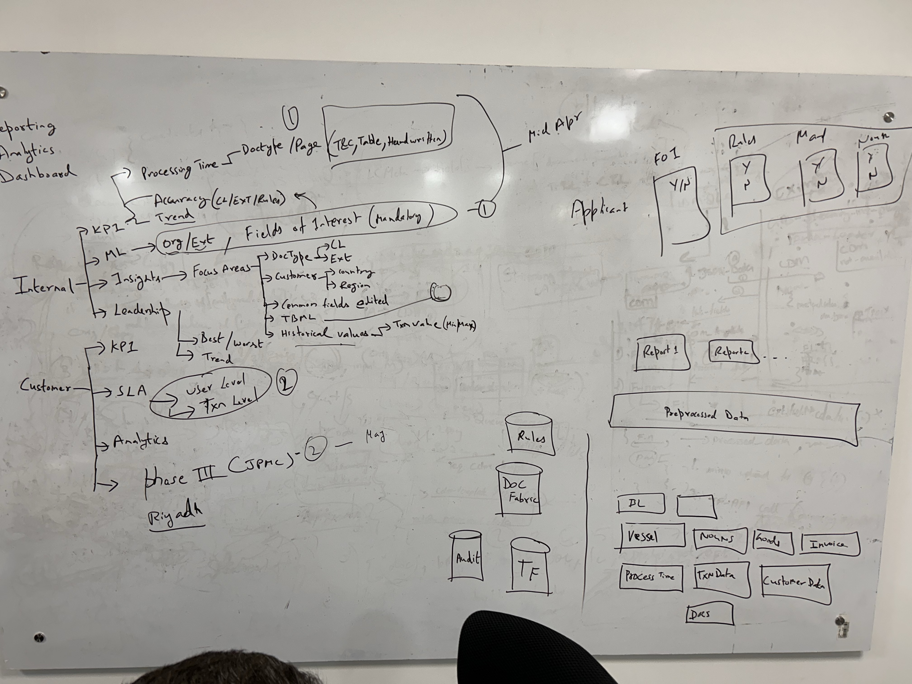

# Index

1. [Introduction](#introduction)
2. [Installation](#installation)
3. [Usage](#usage)
4. [Conclusion](#conclusion)

## Introduction

This is the introduction section.

## Installation

Here are the steps for installation:

| Step | Description |
|------|-------------|
| 1    | Download the installer from [here](https://example.com/installer) |
| 2    | Run the installer |
| 3    | Follow the on-screen instructions |

## Usage

Usage instructions go here.

## Conclusion

In conclusion, ...

